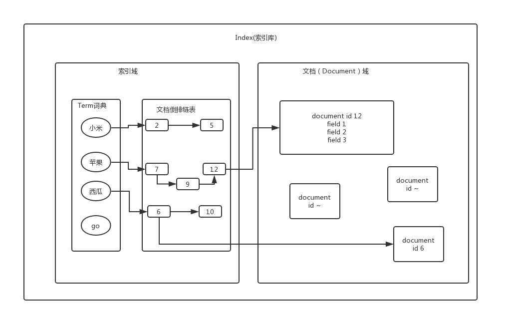

# 前言

> **Lucene学习系列**主要介绍了Lucene、solr和ES三者的特点，**本文**主要介绍了Lucene的原理。


# Lucene是什么
Lucene，主要是用于实现全文搜索的。

全文搜索，即非结构化数据的搜索。它跟结构化数据的搜索，不太一样。
结构化数据，类似于传统关系型数据库Mysql，我们搜索，很简单，写条SQL语句即可。

但是，非结构化数据，顾名思义，就是没有结构的，例如一篇文章，或者一大段文字，哪里来的结构？
所以，针对非结构化数据，我们要想实现搜索，就需要一些方法，Lucene就是这么一个。

# Lucene原理
全文搜索的思路一般如下：

- 将非结构化，转化为结构化

- 提取索引，根据索引进行搜索，类似于查字典

Lucene的实现过程，也是按照上述的两点思想，进行设计，如下：

- 建立索引流程
	1. 采集源数据（从文件，数据库，等若干方面进行采集）
	2. 建立索引

- 搜索流程
	1. 获取查询条件
	2. 搜索索引
	3. 返回搜索结果

看到这里，我们会有些问题，

- 索引是如何创建的？

- 索引是如何存储的？

- 索引又是如何搜索的？

将上面三个问题，弄清楚了，我们就基本了解Lucene的实现思路了。

#### 基本术语
Document 文档，相当于数据库中的一行记录。
Field 字段，相当于数据库中的一列。

#### 索引创建流程

1. 从数据库，或者其他数据源中采集到数据。转化为document格式。
2. 我们需要自己提前定义好document格式，类似于一行记录，中有哪些列（field）。
3. 分析field中的内容
	1. 分词（要注意英文分词和中文分词的实现是不一样的）
	2. 去除标点符号
	3. 去除停用词（类似于，the，a 这些没有含义的词语）
	4. 得到的结果，就是词元（Token）
4. 词元（Token）语言处理
	1. 大写转化小写
	2. 复数变单数
	3. 过去式、将来式转化现在式
	4. 得到词（Term）
5. 索引流程
	1. 创建Term词典
	2. 对词典进行排序
	3. 合并相同的Term并且文档倒排

得到，最终的索引库结构如下图。



#### 中文分词器
Lucene自带有分词器，但是如果是中文分词，我们需要引入一个依赖，IKAnalyzer

#### field属性

- 是否分词
	- 是：将会针对该field进行分词，分词是为了索引

- 是否索引
	- 是：将会针对该field进行索引，索引是为了搜索

- 是否存储
	- 是：将会存储于文档域，只有存储了，才可以搜索时候，获取到。


# Lucene示例代码
注意，下面代码示例中，由于使用的中文分词器ikanalyzer引入了Lucene依赖，所以，我就不需要额外添加Lucene依赖了。
同时，大家需要注意中文分词器和Lucene的版本相容性问题。

#### maven依赖

```
	
    <dependencies>
<!--        <dependency>-->
<!--            <groupId>org.apache.lucene</groupId>-->
<!--            <artifactId>lucene-queryparser</artifactId>-->
<!--            <version>4.7.2</version>-->
<!--        </dependency>-->
<!--        <dependency>-->
<!--            <groupId>org.apache.lucene</groupId>-->
<!--            <artifactId>lucene-analyzers-common</artifactId>-->
<!--            <version>4.7.2</version>-->
<!--        </dependency>-->
        <!--中文分词器-->
        <dependency>
            <groupId>com.janeluo</groupId>
            <artifactId>ikanalyzer</artifactId>
            <version>2012_u6</version>
        </dependency>
    </dependencies>
```

#### 建立索引

```
	public static void main(String[] args) throws IOException {
        //准备测试数据
        List<Map<String,Object>> itemList = new ArrayList<Map<String, Object>>();
        Map<String,Object> item1 = new HashMap<String, Object>();
        item1.put("id",1);
        item1.put("name","张美");
        item1.put("desc","周末去了一趟广美，吃喝玩耍");
        Map<String,Object> item2 = new HashMap<String, Object>();
        item2.put("id",1);
        item2.put("name","张小小");
        item2.put("desc","好好读书，工作，学习。");
        itemList.add(item1);
        itemList.add(item2);

        //构建document
        List<Document> documents = new ArrayList<>();
        for (Map<String,Object> item : itemList){
            Document document = new Document();
            document.add(new TextField("id",item.get("id").toString(), Field.Store.YES));
            document.add(new TextField("name",item.get("name").toString(), Field.Store.YES));
            document.add(new TextField("desc",item.get("desc").toString(), Field.Store.YES));
            documents.add(document);
        }

        //制定中文分词器
//        Analyzer analyzer = new StandardAnalyzer();
        Analyzer analyzer = new IKAnalyzer();

        IndexWriterConfig indexWriterConfig = new IndexWriterConfig(Version.LUCENE_47,analyzer);
        //指定索引库目录
        String indexPath = "C:\\Users\\Administrator\\Downloads\\lunceneIndex";
        Directory directory = FSDirectory.open(new File(indexPath));
        IndexWriter writer = new IndexWriter(directory,indexWriterConfig);
        //构建索引
        writer.addDocuments(documents);

        writer.close();
    }
```

#### 查询索引

```
	
    public static void main(String[] args) throws IOException, ParseException {
        String indexPath = "C:\\Users\\Administrator\\Downloads\\lunceneIndex";
        Directory directory = FSDirectory.open(new File(indexPath));
        IndexReader reader = DirectoryReader.open(directory);
        IndexSearcher searcher = new IndexSearcher(reader);
        Analyzer analyzer = new IKAnalyzer();
        QueryParser parser = new QueryParser(Version.LUCENE_47,"desc",analyzer);

        Query query = parser.parse("工作");
        TopDocs topDocs = searcher.search(query,100);
        ScoreDoc[] scoreDocs = topDocs.scoreDocs;
        for (ScoreDoc scoreDoc : scoreDocs){
            Document document = searcher.doc(scoreDoc.doc);
            System.out.println("desc：" + document.get("desc"));
        }

        reader.close();
    }
```

#### field类的描述以及属性对应
上述建立索引的代码中，有这么一行代码

> (new TextField("name",item.get("name").toString(), Field.Store.YES)

其中TextField是Lucene封装好了的类，不同的field类，针对Field的属性，有默认不同的设置，详情见下。

| Field类 | 数据类型 | 是否分词 | 是否索引 | 是否存储 | 
|：-：|：-：|：-：|：-：|：-：|
|StringField(FieldName,FieldValue,Store.YES)|字符串|N|Y|Y或者N|
|LongField|Long类型|Y|Y|Y或者N|
|StoreField|支持多种类型|N|N|Y|
|TextField|字符串或者流|Y|Y|Y或者N|
 
#### 本地查看索引库工具Luke

Luke工具很简单，只需要从官网下载，运行jar包即可，用于本地开发调试时候，查看生产的索引库，非常好用，但是要注意Luke依赖的Lucene版本。
